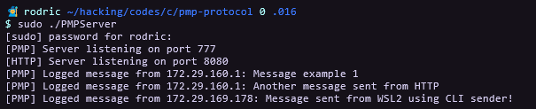
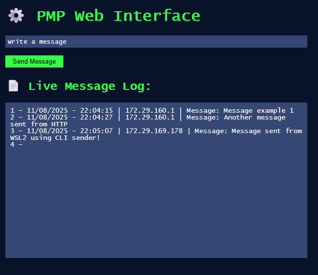

# What is HTTP-Public-Message-Protocol / HPMP?
The main idea of the project is to utilize HPMP inside of a controlled local network environment and to be able to open the HTTP interface via an IoT device.<br>
The concept is to understand in more detail how network connections work in low level.

## Installation & Compiling:

```console
git clone https://github.com/RodricBr/HTTP-Public-Message-Protocol
cd HTTP-Public-Message-Protocol/

# Compiling: 

gcc CLI-HPMP-Sender.c -o CLI-HPMP-Sender
gcc HPMP-Server.c -o HPMP-Server
```

## Executing:

> [!IMPORTANT]
> Server needs to be executed with super user privileges

- Initializing server which creates the HTTP-PMP Server:
```console
./HPMP-Server
```

- Sending messages via CLI:
```console
./CLI-HPMP-Sender -m "Message to send" <SERVER IP>
```

## Examples:
- Executing Server and showing log contents:



- HTTP Sender:


- Sending messages via CLI:


